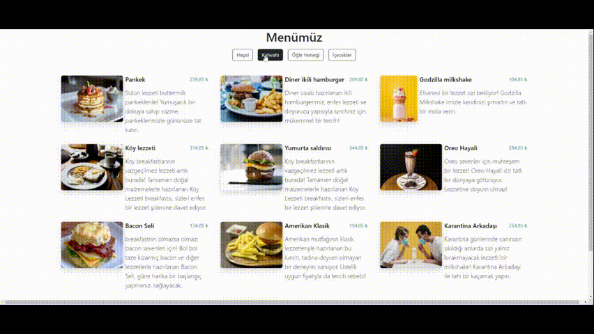

# QR-Menu

<h1> QR Menu </h1>

Bu proje, bir restoran veya kafe için dijital bir menü oluşturmayı amaçlayan basit bir web uygulamasıdır. Müşteriler, web sitesine girerek menüdeki ürünleri görüntüleyebilir ve her ürün için fiyat, açıklama ve görsellere erişebilirler.

Kullanılan Teknolojiler

HTML5
CSS3
Bootstrap 5
JavaScript

<h1> EKRAN GÖRÜNÜMÜ</h1>

